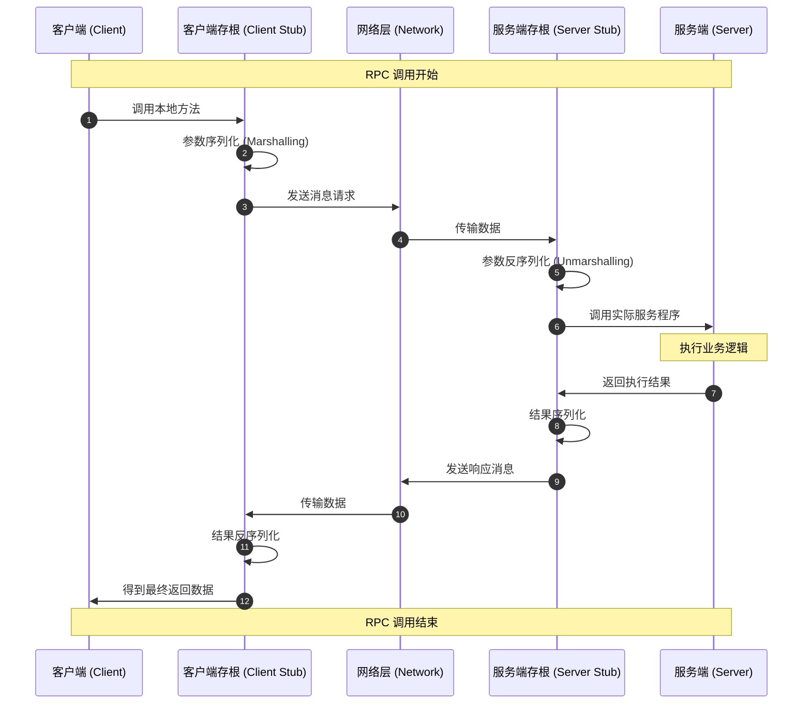

## 简要说说RPC

RPC（Remote Procedure Call，远程过程调用）是一种通信协议，允许程序在不同的计算机上执行代码，就像调用本地函数一样。RPC 的核心思想是隐藏网络通信的复杂性，使得开发者可以像调用本地函数一样调用远程服务。

## RPC 的基本原理包括以下几个步骤：

### 客户端调用远程函数

客户端程序调用一个远程函数，就像调用本地函数一样。但是这个函数实际上是在远程服务器上执行的。是一个代理函数，负责将调用请求发送到服务器。

### 序列化参数

当客户端调用远程函数时，RPC 框架会将函数的参数进行序列化（也称为编码），将其转换为一种可以通过网络传输的格式。常见的序列化格式包括 JSON、XML、Protocol Buffers（常用） 等。

### 发送请求

序列化后的请求通过网络发送到远程服务器。RPC 框架负责处理网络通信，确保请求能够正确地到达服务器。通常会使用 TCP/IP 协议进行通信。

### 服务器处理请求

服务器接收到请求后，RPC 框架会将请求进行反序列化（解码），提取出函数名称和参数。然后服务器会调用相应的函数来处理请求。

### 序列化响应

服务器处理完请求后，会将结果进行序列化，并通过网络发送回客户端。客户端接收到响应后，会将其反序列化，得到函数的返回值，从而完成一次完整的远程过程调用。

### 客户接收结果

客户端接收到结果后，反序列化为本地数据，从而完成一次完整的远程过程调用。

## 流程图

## RPC 的核心组件

- **客户端存根（Client Stub）**：负责将本地调用转换为网络请求，并处理结果的返回。
- **服务器存根（Server Stub）**：负责接收网络请求，调用本地函数，并返回结果。
- **序列化/反序列化**：将数据转换为网络传输格式（如 JSON、Protobuf、Thrift 等）。
- **网络通信**：负责在客户端和服务器之间传输数据（如 TCP、HTTP、gRPC 等）。

## RPC 的优点和缺点

### 优点

- **抽象化**：RPC 隐藏了网络通信的复杂性，使得开发者可以像调用本地函数一样调用远程服务。
- **语言无关**：RPC 可以支持不同编程语言之间的通信，只要双方使用相同的协议和数据格式。
- **分布式系统支持**：RPC 是构建分布式系统的基础，可以实现跨服务器、跨数据中心的通信。
- **性能**：一些高效的 RPC 框架（如 gRPC）使用二进制协议和高效的序列化方法，可以提供较低的延迟和较高的吞吐量。

### 缺点

- **网络延迟**：由于涉及网络通信，RPC 调用的延迟通常比本地函数调用高。
- **错误处理复杂**：网络通信可能会失败，RPC 调用需要处理各种异常情况，如超时、网络中断等。
- **调试困难**：由于 RPC 调用涉及多个系统和网络通信，调试可能比本地函数调用更复杂。

## 结论

RPC 是一种强大的通信协议，广泛应用于分布式系统和微服务架构中。理解 RPC 的原理和组件对于构建高效、可靠的分布式应用程序至关重要。虽然 RPC 有一些缺点，但通过合理的设计和使用合适的框架，可以最大限度地发挥其优势。
