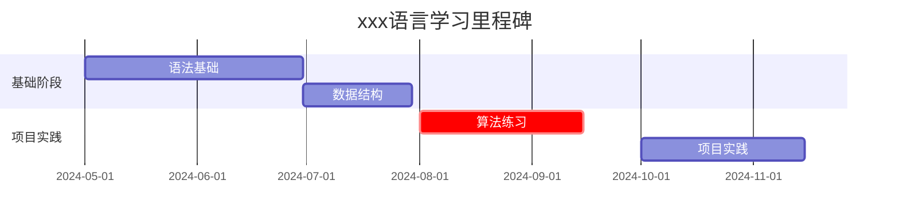

## 背景：为何制定个人成长计划？

---

1. 技术爆炸下的焦虑与机遇（Why Now?）

在AI渗透率高达 *80%~90%* 的编程领域，传统的“**<cite>填鸭式学习[^1]</cite>**”已失去效率。当ChatGPT能在10秒内生成基础代码时，我意识到：单纯记忆语法不再具有竞争力，未来需要系统化的知识框架和创造性解决问题的能力。
<!--more-->

2. 过往学习模式的痛点诊断

- **碎片化学习**：知识点零散，难以形成体系。
- **时间管理缺失**：不清楚时间花在哪里。
- **学习动力不足**：焦虑多于成果，缺乏持续性。

## 认知革命：从学生思维到创造者思维

---

### 1. 破除"学习道德主义"陷阱

我曾陷入“每天必须学X小时”的误区，追求时长而非效果。这违背了<cite>《深度工作》[^2]</cite>的核心公式：

**高质量产出 = 专注时间 × 认知强度**。

真正的成长应注重深度而非表面的努力。

### 2. 构建第二大脑（Building a Second Brain）

**[P.A.R.A.](https://fortelabs.com/blog/para/)** 是一种组织信息的思路，但并不是某种具体的规范和教条，其核心是「根据信息的可操作性程度，对信息进行聚焦或转移」

P.A.R.A. 是 **项目（Project）**、**领域（Area）**、**资源（Resource）**、 **档案（Archive）** 的简称。
这四个一级分类涵盖了你在工作和生活中可能遇到的所有类型的信息。

#### **1. 💻项目(Project):**

一定要具有明确的目标以及时间范围，是最小执行单位

- 范围：聚焦于较小的短期作业承诺，避免因周期太长而导致缺乏成就感。
- 预期：有一个可以明确的成效，具有可描述可量化的最终状态。
- 时间：有截止日期或交付日期，制定一个结束时间（也就能知道何时应该复盘）

#### **2. 🎨领域(Area):**

把领域定义为「**需要精进的方向**」 你在平时需要精进的领域
它是一个你自己的*终身目标*，在接下来的时间里面你要对你自己的Area负责，Area的界定是有多少，
范围有多少都有你自己来定✏，领域一般没有结束的日期或最终的结果。
你在这方面的表现可能会随着时间的推移而起起伏伏，但是这个标准会无限期地持续下去，
并且在任何时候都需要一定程度的关注。

#### **3. 📚资源(Resource):**

> 大脑数据库？

你感兴趣的事情，也是支撑现在 Area 和将来 Area 的外部知识储备
一定要基于 Area （或者将来潜在的 Area）作为精进的方向，然后把资源当做 Area 的基石和养分，避免造成范围过大而精力不佳

#### **4. 💾归档(Archive):**

> 沉寂的内容，但也许对未来有用,让知识像邮件一样归入笔记夹吧

随着时间的推移，有些兴趣爱好会沉寂下来，有些项目会停止，有些领域会结束，这很正常。
不必删除与之相关的信息，因为你永远不知道它什么时候会再次活跃起来。
但在这期间，将资源笔记本归档，避免让你的工作空间变得杂乱无章。💡

## 重构大脑：构建自己的体系

---
我将自己的人生计划分为 **健康**、**生活**、**学习**、**社交**、**娱乐** 和 **工作** 六个方向，并为这些方向分配合适的颜色，同时与工具整合。


工具应服务于成长，而非成为负担


### 核心工具

- **Google Calendar**：规划“语言学习/编程/阅读”三大模块，进行时间管理。
- **Notion**：记录灵感、构建知识数据库。
- **Obsidian/logseq**：基于P.A.R.A.管理个人知识，未来可扩展为博客。
- **Hugo+Github Pages**：搭建技术博客，分享成果。

### 资源配置

#### 1. 学习（Learning）


>建议颜色：蓝色

理由：蓝色象征知识、智慧和专注，非常适合学习相关的活动（如语言学习、编程、阅读）。它能帮助你保持冷静和集中注意力。

工具整合：

- Google Calendar：创建一个“学习”日历，标记语言学习、编程练习和阅读时间。
- Notion：建立“学习”数据库，记录闪点思维、学习笔记和资源链接。
- Obsidian：用P.A.R.A.方法（Projects, Areas, Resources, Archives）整理学习笔记，建立知识体系。
- Hugo+Github Pages：将学习成果（如编程项目、读书笔记）发布到技术博客。


#### 2. 生活（Life）


>建议颜色：绿色

理由：绿色代表自然、平衡和日常生活，能提醒你在忙碌中关注生活的和谐与健康。

工具整合：

- Google Calendar：创建一个“生活”日历，记录日常安排（如购物、家务、休息）。
- Notion：建立“生活”页面，追踪习惯、记录灵感和待办事项。
- Obsidian：管理生活相关的笔记，如旅行计划或日常反思。
- Hugo+Github Pages：分享生活经验或实用小技巧。


#### 3. 工作（Work）


> 建议颜色：红色

理由：红色象征能量、行动和紧迫性，适合工作相关的任务和截止日期，能激发效率和动力。

工具整合：

- Google Calendar：创建一个“工作”日历，标记会议、任务和项目时间。
- Notion：建立“工作”数据库，管理项目进度、任务清单和会议记录。
- Obsidian：整理工作相关的文档和知识点，便于快速检索。
- Hugo+Github Pages：发布工作相关的技术文章或项目总结。


#### 4. 社交（Social）


>建议颜色：橙色

理由：橙色温暖而友好，非常适合社交活动，能营造轻松愉快的氛围。

工具整合：

- Google Calendar：创建一个“社交”日历，记录聚会、活动和朋友见面。
- Notion：建立“社交”页面，记录联系人信息和活动计划。
- Obsidian：管理社交相关的笔记，如活动回顾或人际关系心得。
- Hugo+Github Pages：分享社交活动的照片或故事。


#### 5. 娱乐（Entertainment）


> 建议颜色：紫色

理由：紫色与创造力、想象力和娱乐相关，适合休闲活动，能激发灵感和放松心情。

工具整合：

- Google Calendar：创建一个“娱乐”日历，记录电影、游戏或音乐会时间。
- Notion：建立“娱乐”数据库，记录电影清单、游戏进度或兴趣推荐。
- Obsidian：整理娱乐相关的笔记，如影评或游戏攻略。
- Hugo+Github Pages：发布娱乐相关的文章或创意内容。


#### 6. 健康（Health）


> 建议颜色：黄色

理由：黄色代表活力、健康和积极，适合与运动和健康相关的活动，能提升能量和乐观情绪。

工具整合：

- Google Calendar：创建一个“健康”日历，记录锻炼、医疗预约或冥想时间。
- Notion：建立“健康”页面，追踪饮食、运动和睡眠数据。
- Obsidian：管理健康知识，如营养学或运动技巧。
- Hugo+Github Pages：分享健康生活建议或运动经验。


## 执行阶段: 主要任务和时间规划

---

### 编程学习路径（Reddit r/learnprogramming推荐模式）

简单来说，利用[x&y](https://learnxinyminutes.com/)来入门，然后通过[LeetCode](https://leetcode.com/)来练习算法，最后通过[Project Euler](https://projecteuler.net/)来提升编程问题能力，在[github](http://github.com)上找合适的项目学习。

比如可以：

### 语言提升策略（基于<cite>CEFR[^3]</cite>标准）

如：

1. **英语沉浸式学习法**：
   - 每日晨间执行"30分钟黄金圈"：
     - 5分钟影子跟读（TED演讲等）
     - 15分钟精读（《The Economist》科技版等）
     - 10分钟写作（Reddit语言交换板块等）

2. **日语结构化提升**：
   - 每周完成3次日语新闻听写（NHK Web News等）
   - 每月参与1次日语角（本地语言交换社群等）

## 成长之路：阶段性目标与评估体系

---

### 量化评估体系

比如下表：

| 指标                | 验证方式                          | 目标值               |
|---------------------|-----------------------------------|----------------------|
| Python技能          | GitHub项目星标+课程认证           | 3个完整项目+认证证书 |
| 英语能力            | 模拟测试                          | 阅读380/听力470      |
| 日语能力            | JLPT N2模拟测试                   | 文字词汇60+/听力50+  |
| 知识内化            | Notion知识库条目                  | 200+概念卡片         |

### 成果展示平台

- **技术博客**：每月(?)更新1篇编程笔记（Hugo+Github Pages）
- **语言日志**：自己的笔记平台提交双/三语文章
- **社群互动**：Reddit 等分享

## 飞升总结：优化与改进

---

### 复盘方法论

1. **五问法分析**（参考《哈佛商业评论》复盘指南）：
   - 实际成果与预期差距？
   - 哪些方法论最有效？（如GTD的2分钟原则）
   - 哪些资源未被充分利用？
   - 时间分配是否需要优化？
   - 下一周期如何改进？

2. **PDCA循环改进**：
   - Plan：制定2025-2026学习规划
   - Do：建立新Notion模板
   - Check：分析Google Calendar时间记录
   - Act：调整晨间晚间学习模块

## 前路漫漫：持续成长机制

基于**自我决定理论**（Self-Determination Theory），构建三要素激励系统：

1. **自主性**：每月设置"自由探索日"（尝试R语言/Go语言）
2. **胜任感**：季度成就墙（Notion进度看板）
3. **归属感**：加入Codecademy学习小组

> "The key is not to prioritize what's on your schedule, but to schedule your priorities." —— Stephen Covey《高效能人士的七个习惯》

本计划通过Notion模板动态更新，每周日20:00进行进度审查，并更新个人博客，持续优化个人成长系统。

[^1]: 填鸭式学习（Cramming）是一种教学方法，类似于饲养员强制给鸭子喂食以使其快速增肥的方式。
[^2]: 《深度工作：在分心世界中取得成功的规则》（Deep Work: Rules for Focused Success in a Distracted World）是美国作家、乔治城大学计算机科学教授卡尔·纽波特（Cal Newport）于 2016 年出版的一本关于提高专注力和工作效率的书籍。
[^3]: [CEFR 标准](https://en.wikipedia.org/wiki/Common_European_Framework_of_Reference_for_Languages)，全称为“欧洲语言共同参考框架”（Common European Framework of Reference for Languages: Learning, teaching, assessment，简称 CEFR），是由欧洲委员会（Council of Europe）在2001年正式发布的一套语言能力评估标准。它旨在为欧洲及其他地区的语言学习、教学和评估提供一个共同的基础和参考。
