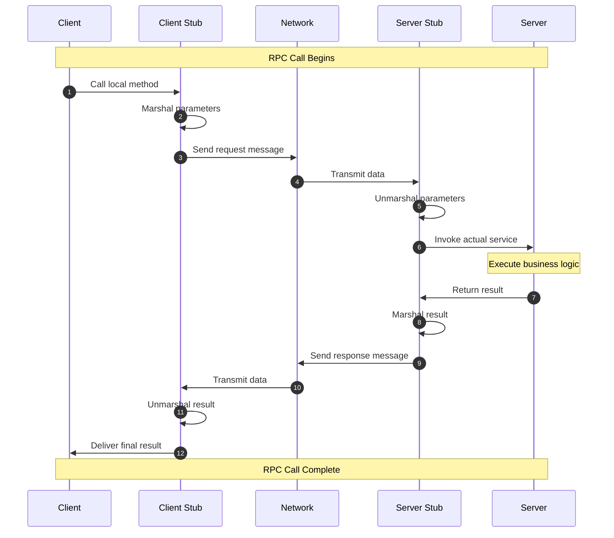

---
aliases:
  - /blog/rpc_principle/
  - /blog/RPC_principle/
title: "How RPC Works"
date: 2026-04-23T19:27:41+08:00
draft: false
authors:
  - name: "Yeelight"
    link: https://github.com/FeiNiaoBF
    image: https://github.com/FeiNiaoBF.png
math: false
toc: true
comments: true
tags:
  - RPC
  - Distributed Systems
  - Microservices
---

## RPC in a Nutshell

RPC (Remote Procedure Call) is a communication protocol that lets a program execute code on a different machine as if it were calling a local function. The core idea is to hide the complexity of network communication so developers can invoke remote services just like local function calls.

## How RPC Works — Step by Step

### 1. Client Calls the Remote Function

The client calls a remote function as if it's local. But the function actually lives on a remote server. A **proxy function** (the client stub) handles wrapping up the call and sending it over the network.

### 2. Serialize the Parameters

When the client calls the remote function, the RPC framework serializes (marshals) the parameters into a network-transmittable format. Common serialization formats include JSON, XML, and Protocol Buffers (widely used).

### 3. Send the Request

The serialized request is sent over the network to the remote server. The RPC framework handles the network transport, typically over TCP/IP, ensuring the request reaches its destination.

### 4. Server Processes the Request

The server receives the request, deserializes (unmarshals) it to extract the function name and parameters, then invokes the corresponding function.

### 5. Serialize the Response

Once the server processes the request, it serializes the result and sends it back over the network. The client deserializes the response and gets the return value — completing one full remote procedure call.

### 6. Client Receives the Result

The client receives the serialized result, deserializes it into native data structures, and the RPC call is complete.

## Flow Diagram

## Core RPC Components

- **Client Stub**: Converts a local call into a network request and handles the returned result.
- **Server Stub**: Receives network requests, invokes local functions, and returns results.
- **Serialization/Deserialization**: Converts data to and from a network format (JSON, Protobuf, Thrift, etc.).
- **Network Transport**: Handles data transmission between client and server (TCP, HTTP, gRPC, etc.).

## Pros and Cons of RPC

### Pros

- **Abstraction**: Hides network complexity — remote calls feel like local calls.
- **Language-Agnostic**: Different programming languages can communicate as long as they share the same protocol and data format.
- **Distributed System Ready**: RPC is the foundation for building distributed systems, enabling cross-server and cross-datacenter communication.
- **Performance**: Efficient RPC frameworks (like gRPC) use binary protocols and optimized serialization for low latency and high throughput.

### Cons

- **Network Latency**: RPC calls are inherently slower than local function calls due to network round-trips.
- **Complex Error Handling**: Network failures mean RPC calls must handle timeouts, disconnections, and retries.
- **Harder Debugging**: RPC spans multiple systems and network hops, making debugging more involved than local calls.

## Conclusion

RPC is a powerful communication protocol widely used in distributed systems and microservice architectures. Understanding its principles and components is essential for building efficient, reliable distributed applications. While RPC has drawbacks, thoughtful design and the right framework choices can maximize its benefits.
