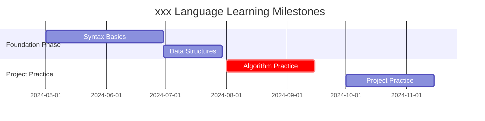

---
aliases:
  - /blog/plan_cs/
title: "⭐ Personal Growth Plan"
draft: false
authors:
  - name: "Yeelight"
    link: https://github.com/FeiNiaoBF
    image: https://github.com/FeiNiaoBF.png

math: true
toc: true
comments: true
weight: 1
tags:
  - Personal Growth
  - Learning Plan
---

## Background: Why Create a Personal Growth Plan?

---

1. Anxiety and Opportunity Amid the Tech Explosion (Why Now?)

In the programming world where AI penetration has reached as high as *80%~90%*, the traditional "**<cite>cramming-style learning[^1]</cite>**" has lost its efficiency. When ChatGPT can generate basic code in 10 seconds, I realized: memorizing syntax alone is no longer competitive — the future demands systematic knowledge frameworks and creative problem-solving abilities.
<!--more-->

2. Pain Points Diagnosed in Past Learning Patterns

- **Fragmented learning**: Scattered knowledge points, difficult to form a system.
- **Lack of time management**: Unclear where time is being spent.
- **Insufficient learning motivation**: More anxiety than results, lacking sustainability.

## Cognitive Revolution: From Student Mindset to Creator Mindset

---

### 1. Breaking the "Learning Moralism" Trap

I once fell into the trap of thinking "I must study X hours every day," pursuing duration over effectiveness. This contradicts the core formula of <cite>*Deep Work*[^2]</cite>:

**High-quality output = Focus time × Cognitive intensity**.

True growth should emphasize depth over surface-level effort.

### 2. Building a Second Brain

**[P.A.R.A.](https://fortelabs.com/blog/para/)** is a framework for organizing information — not a rigid specification or dogma. Its core principle is to "focus or transfer information based on its actionability."

P.A.R.A. stands for **Project**, **Area**, **Resource**, and **Archive**.
These four top-level categories cover all types of information you may encounter in work and life.

#### **1. 💻 Project:**

Must have clear goals and a time scope — the smallest unit of execution.

- Scope: Focus on smaller, short-term commitments to avoid losing motivation due to overly long cycles.
- Expectations: A clearly describable and quantifiable end state.
- Time: A deadline or delivery date — know when to review and reflect.

#### **2. 🎨 Area:**

Define an area as "**a direction requiring continuous refinement**" — a domain you need to improve in over time.
It's your own *lifelong goal*. Over time, you are responsible for your Areas. You define their boundaries and scope ✏. Areas generally have no end date or final outcome.
Your performance in these areas may fluctuate, but the standard persists indefinitely and requires a certain level of ongoing attention.

#### **3. 📚 Resource:**

> Your brain's database?

Things you're interested in — the external knowledge base supporting current and future Areas.
Always base resources on Areas (or potential future Areas) as refinement directions, treating resources as the foundation and nourishment of Areas, avoiding over-expansion of scope that drains energy.

#### **4. 💾 Archive:**

> Dormant content that may be useful in the future — let knowledge slide into notebook folders like email.

Over time, some interests quiet down, some projects stop, some areas conclude. This is normal.
Don't delete related information — you never know when it'll become active again.
But in the meantime, archive resource notebooks to avoid cluttering your workspace. 💡

## Rebuilding the Brain: Building Your Own System

---

I divide my life plan into six directions: **Health**, **Life**, **Learning**, **Social**, **Entertainment**, and **Work**, assigning appropriate colors to each direction while integrating with tools.

Tools should serve growth, not become a burden.

### Core Tools

- **Google Calendar**: Plan "language learning/programming/reading" three modules for time management.
- **Notion**: Record inspiration, build a knowledge database.
- **Obsidian/logseq**: Manage personal knowledge based on P.A.R.A., expandable to a blog in the future.
- **Hugo+Github Pages**: Build a technical blog, share achievements.

### Resource Configuration

#### 1. Learning

> Recommended Color: Blue

Rationale: Blue symbolizes knowledge, wisdom, and focus — perfect for learning-related activities (language learning, programming, reading). It helps you stay calm and focused.

Tool Integration:

- Google Calendar: Create a "Learning" calendar, marking language study, coding practice, and reading time.
- Notion: Build a "Learning" database to record flash thoughts, study notes, and resource links.
- Obsidian: Use the P.A.R.A. method (Projects, Areas, Resources, Archives) to organize study notes and build a knowledge system.
- Hugo+Github Pages: Publish learning outcomes (programming projects, reading notes) to your technical blog.

#### 2. Life

> Recommended Color: Green

Rationale: Green represents nature, balance, and daily life — reminding you to pay attention to harmony and health amidst busyness.

Tool Integration:

- Google Calendar: Create a "Life" calendar, recording daily arrangements (shopping, chores, rest).
- Notion: Build a "Life" page to track habits, record inspiration and to-dos.
- Obsidian: Manage life-related notes like travel plans or daily reflections.
- Hugo+Github Pages: Share life experiences or practical tips.

#### 3. Work

> Recommended Color: Red

Rationale: Red symbolizes energy, action, and urgency — suitable for work-related tasks and deadlines, stimulating efficiency and motivation.

Tool Integration:

- Google Calendar: Create a "Work" calendar, marking meetings, tasks, and project time.
- Notion: Build a "Work" database to manage project progress, task lists, and meeting notes.
- Obsidian: Organize work-related documents and knowledge points for quick retrieval.
- Hugo+Github Pages: Publish work-related technical articles or project summaries.

#### 4. Social

> Recommended Color: Orange

Rationale: Orange is warm and friendly — perfect for social activities, creating a relaxed and pleasant atmosphere.

Tool Integration:

- Google Calendar: Create a "Social" calendar, recording gatherings, events, and meetups.
- Notion: Build a "Social" page, recording contact information and activity plans.
- Obsidian: Manage social-related notes like event reviews or relationship insights.
- Hugo+Github Pages: Share photos or stories from social activities.

#### 5. Entertainment

> Recommended Color: Purple

Rationale: Purple relates to creativity, imagination, and entertainment — suitable for leisure activities, inspiring creativity and relaxation.

Tool Integration:

- Google Calendar: Create an "Entertainment" calendar, recording movies, games, or concerts.
- Notion: Build an "Entertainment" database, recording movie lists, game progress, or interest recommendations.
- Obsidian: Organize entertainment-related notes like movie reviews or game guides.
- Hugo+Github Pages: Publish entertainment-related articles or creative content.

#### 6. Health

> Recommended Color: Yellow

Rationale: Yellow represents vitality, health, and positivity — suitable for sports and health-related activities, boosting energy and optimism.

Tool Integration:

- Google Calendar: Create a "Health" calendar, recording exercise, medical appointments, or meditation time.
- Notion: Build a "Health" page, tracking diet, exercise, and sleep data.
- Obsidian: Manage health knowledge like nutrition or exercise techniques.
- Hugo+Github Pages: Share health advice or exercise experience.

## Execution Phase: Main Tasks and Time Planning

---

### Programming Learning Path (Recommended by Reddit r/learnprogramming)

Simply put, use [x&y](https://learnxinyminutes.com/) for getting started, then practice algorithms via [LeetCode](https://leetcode.com/), and finally improve problem-solving skills through [Project Euler](https://projecteuler.net/), finding suitable projects on [GitHub](http://github.com) to learn from.

For example:

### Language Improvement Strategy (Based on <cite>CEFR[^3]</cite> Standards)

For example:

1. **English Immersive Learning Method**:
   - Daily morning "30-Minute Golden Circle":
     - 5 minutes shadowing (TED Talks, etc.)
     - 15 minutes intensive reading (The Economist tech section, etc.)
     - 10 minutes writing (Reddit language exchange boards, etc.)

2. **Japanese Structured Improvement**:
   - Complete 3 Japanese news dictations per week (NHK Web News, etc.)
   - Participate in 1 Japanese corner per month (local language exchange communities, etc.)

## The Road of Growth: Phased Goals and Assessment System

---

### Quantitative Assessment System

For example, a table like this:

| Metric                | Verification Method                      | Target Value                    |
|-----------------------|------------------------------------------|---------------------------------|
| Python Skills         | GitHub project stars + course certificates | 3 complete projects + certs     |
| English Proficiency   | Mock tests                               | Reading 380 / Listening 470     |
| Japanese Proficiency  | JLPT N2 mock tests                       | Vocabulary 60+ / Listening 50+  |
| Knowledge Internalization | Notion knowledge base entries         | 200+ concept cards              |

### Achievement Showcase Platforms

- **Technical Blog**: Update 1 programming note per month(?) (Hugo+Github Pages)
- **Language Log**: Submit bilingual/trilingual articles on personal note platform
- **Community Interaction**: Share on Reddit, etc.

## Ascension Summary: Optimization and Improvement

---

### Review Methodology

1. **Five Whys Analysis** (referencing Harvard Business Review review guidelines):
   - Gap between actual outcomes and expectations?
   - Which methodologies were most effective? (e.g., GTD's 2-minute rule)
   - Which resources were underutilized?
   - Does time allocation need optimization?
   - How to improve in the next cycle?

2. **PDCA Cycle Improvement**:
   - Plan: Develop 2025-2026 learning plan
   - Do: Create new Notion templates
   - Check: Analyze Google Calendar time records
   - Act: Adjust morning/evening learning modules

## The Long Road Ahead: Continuous Growth Mechanisms

Based on **Self-Determination Theory**, build a three-element motivation system:

1. **Autonomy**: Set up a monthly "Free Exploration Day" (try R/Go)
2. **Competence**: Quarterly achievement wall (Notion progress dashboard)
3. **Relatedness**: Join Codecademy study groups

> "The key is not to prioritize what's on your schedule, but to schedule your priorities." —— Stephen Covey, *The 7 Habits of Highly Effective People*

This plan is dynamically updated via Notion templates, with progress reviews every Sunday at 20:00, and personal blog updates to continuously optimize the personal growth system.

[^1]: Cramming is a teaching method similar to how farmers force-feed ducks to fatten them quickly.
[^2]: *Deep Work: Rules for Focused Success in a Distracted World* is a 2016 book by American author and Georgetown University computer science professor Cal Newport about improving focus and work efficiency.
[^3]: [CEFR](https://en.wikipedia.org/wiki/Common_European_Framework_of_Reference_for_Languages), the Common European Framework of Reference for Languages: Learning, teaching, assessment, is a language proficiency assessment standard officially published by the Council of Europe in 2001. It aims to provide a common basis and reference for language learning, teaching, and assessment across Europe and beyond.
